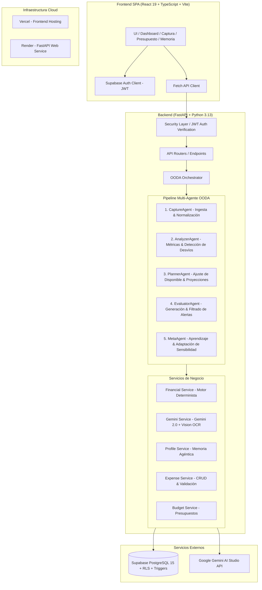
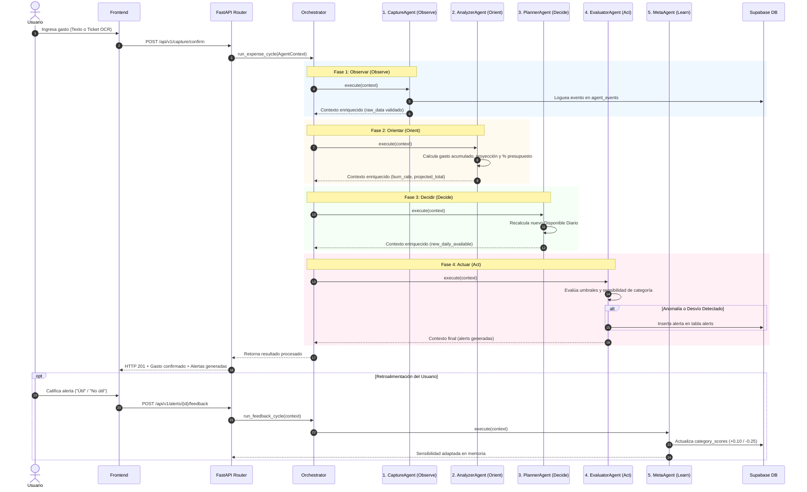

# 📊 Peso a Peso — Reporte Técnico de Arquitectura

**Sistema Inteligente de Gestión Financiera Doméstica con Orquestación Multi-Agente (Ciclo OODA)**

---

## 1. Resumen Ejecutivo

**Peso a Peso** es una plataforma web full-stack diseñada para resolver el problema de la pérdida de referencia de precios y la dificultad de planificación financiera familiar en economías de alta inflación y volatilidad (como la economía argentina).

A diferencia de las aplicaciones tradicionales de finanzas personales que funcionan como meros libros contables pasivos, **Peso a Peso** implementa una **Arquitectura Multi-Agente basada en el Ciclo OODA (Observe, Orient, Decide, Act, Learn)**. Combina un **motor determinista de cálculo financiero en tiempo real** con **modelos de lenguaje multimodal (Google Gemini 2.0 Flash y Gemini Vision OCR)** y un sistema de **aprendizaje continuo por refuerzo a través de retroalimentación del usuario**.

---

## 2. Contexto de Dominio y Justificación Técnica

### 2.1. La Problemática Financiera Doméstica en Argentina
1. **Pérdida de la Ancla de Precios**: La dispersión de precios hace que los usuarios no sepan si un gasto cotidiano es normal o anómalo.
2. **Complejidad del "Disponible Diario"**: Calcular cuánto dinero se puede gastar hoy sin comprometer los gastos fijos ni exceder el presupuesto mensual requiere proyecciones continuas del ritmo de gasto (*burn rate*).
3. **Fricción de Carga**: La mayoría de las aplicaciones fallan por la alta fricción manual para registrar tickets y transferencias.

### 2.2. Por qué una Arquitectura Multi-Agente Híbrida
- **Los LLMs puros no son confiables para matemáticas financieras**: Pueden alucinar totales, porcentajes o proyecciones.
- **Solución implementada**: Los cálculos matemáticos (disponible diario, desvíos, proyecciones) se ejecutan mediante un **motor determinista en Python** con precisión decimal. Los LLMs (**Gemini 2.0 Flash**) se utilizan exclusivamente para tareas cognitivas: extracción de entidades en lenguaje natural, OCR visual de comprobantes, detección cualitativa de anomalías y sugerencias contextuales.

---

## 3. Arquitectura Global del Sistema

---

## 4. El Ciclo OODA Multi-Agente en Detalle

Cada evento de gasto desencadena una ejecución secuencial a través de una estructura de memoria compartida denominada `AgentContext`.

### Especificación de los 5 Agentes

| Agente | Fase OODA | Rol Principal | Entrada | Salida |
|---|---|---|---|---|
| **`CaptureAgent`** | **Observe** | Ingesta de datos, validación sintáctica y trazabilidad inicial | Gasto crudo (monto, fecha, categoría, comercio) | `AgentContext` validado y evento auditado en `agent_events` |
| **`AnalyzerAgent`** | **Orient** | Cálculo del ritmo de gasto (*burn rate*), proyección de fin de mes y % de presupuesto consumido | Gastos del mes + Presupuesto activo | `projected_spending`, `budget_consumed_pct`, `is_over_budget` |
| **`PlannerAgent`** | **Decide** | Proyección del presupuesto disponible y recalibración del Disponible Diario para los días restantes | Presupuesto total - Gastos fijos - Gastos reales acumulados | `new_daily_available`, `days_remaining` |
| **`EvaluatorAgent`** | **Act** | Evaluación de reglas de negocio, ponderación de sensibilidad del perfil y emisión de alertas | Métricas del Analyzer/Planner + Perfil de Memoria | Alerta persistida en `alerts` o suprimida por baja sensibilidad |
| **`MetaAgent`** | **Learn** | Aprendizaje continuo a partir del feedback explícito del usuario para adaptar la sensibilidad de alertas | Feedback del usuario (`is_useful: bool`, `alert_id`) | Actualización incremental en `profiles.category_scores` |

---

## 5. Modelado Matemático Determinista

### 5.1. Disponible Diario ($D_d$)

El disponible diario representa el monto promedio seguro que el usuario puede gastar por día durante el resto del período mensual:

$$D_d = \frac{P_{neto} - G_{acum}}{N_{dias\_restantes}}$$

Donde:
- $P_{neto} = P_{total} - \sum F_{prioridad\_alta}$ (Presupuesto total menos gastos fijos comprometidos de alta prioridad).
- $G_{acum} = \sum_{i=1}^{k} Monto_i$ (Suma de gastos variables confirmados en el mes en curso).
- $N_{dias\_restantes} = D_{fin\_mes} - D_{hoy} + 1$ (Días calendario restantes en el período).

### 5.2. Proyección de Gasto Lineal ($G_{proy}$)

$$G_{proy} = \begin{cases} \left( \frac{G_{acum}}{D_{hoy}} \right) \times D_{total\_mes} & \text{si } D_{hoy} > 0 \\ G_{acum} & \text{si } D_{hoy} = 0 \end{cases}$$

### 5.3. Algoritmo de Aprendizaje y Sensibilidad Adaptativa del Meta-Agente

Cada usuario mantiene en su perfil un vector dinámico de sensibilidad por categoría $S_c \in [0.0, 1.0]$, inicializado en $1.0$ (sensibilidad completa):

$$S_c^{(t+1)} = \begin{cases} 
\min(1.0, \, S_c^{(t)} + 0.10) & \text{si feedback = Útil} \\ 
\max(0.0, \, S_c^{(t)} - 0.25) & \text{si feedback = No útil} 
\end{cases}$$

**Regla de Supresión**: El `EvaluatorAgent` solo emite alertas si:
$$S_c \ge 0.60 \quad \land \quad \text{Desvío} \ge Umbral_{severidad}$$

---

## 6. Integración de Inteligencia Artificial (Google Gemini)

### 6.1. Extracción de Lenguaje Natural (Gemini 2.0 Flash)
- **Prompt estructurado**: Diseñado para lenguaje coloquial argentino (*"Gasté 15 lucas en Coto ayer comprando carne"*).
- **Inferencia estructurada**: Retorna JSON estricto con `amount`, `merchant`, `expense_date`, `category_slug`, `confidence`.
- **Estrategia Fallback Determinista**: Si la API de Gemini no está disponible o se agota la cuota, entra en acción un parser determinista basado en expresiones regulares argentinas (`$15.000`, `15k`, `15 lucas`) y un diccionario canónico de comercios (Coto, Carrefour, YPF, Shell, Farmacity, Edenor, Movistar, etc.).

### 6.2. Procesamiento Multimodal / OCR (Gemini Vision)
- **Procesamiento de imagen**: Ingesta directa de bytes de imagen (`image/jpeg`, `image/png`, `image/webp`) mediante el SDK oficial `google-genai` (`types.Part.from_bytes`).
- **Extracción de comprobantes**: Identificación de CUIT/Razón Social, fecha de emisión, total facturado y rubro comercial.
- **Flujo Human-in-the-Loop**: Los datos extraídos se presentan en el frontend en una tarjeta interactiva con indicador de confianza (`CandidateReviewCard`) para que el usuario valide o corrija antes de confirmar la persistencia.

---

## 7. Modelo de Datos y Seguridad (Supabase PostgreSQL)

### 7.1. Esquema Relacional de 10 Tablas
1. `profiles`: Perfil de usuario, ingresos, tono preferido (`neutral`, `coach`, `strict`), frecuencia de alerta y `category_scores` (JSONB).
2. `categories`: Maestro de rubros financieros (Comida, Servicios, Transporte, Ocio, Vivienda, Salud, Educación, Otros).
3. `budgets`: Presupuestos mensuales por usuario con restricción de unicidad `(user_id, month)`.
4. `expenses`: Gastos registrados con campos de origen (`manual`, `text`, `ocr`), comercio, monto, confirmación y FKs.
5. `fixed_expenses`: Gastos recurrentes (alquiler, expensas, internet) con prioridad (`alta`, `media`, `baja`).
6. `alerts`: Alertas generadas por el `EvaluatorAgent` (`info`, `warning`, `danger`, `opportunity`) con estado de lectura.
7. `alert_feedback`: Historial de calificaciones de alertas por usuario.
8. `behavior_profiles`: Métricas históricas de comportamiento financiero.
9. `financial_snapshots`: Registro histórico mensual para análisis de evolución.
10. `agent_events`: Trazabilidad y observabilidad del ciclo OODA con duración en milisegundos y payloads de entrada/salida.

### 7.2. Triggers y Automatizaciones PostgreSQL
- **Trigger `on_auth_user_created`**: Inserta automáticamente un registro en `public.profiles` ante cada nuevo registro en `auth.users`, evitando inconsistencias de claves foráneas.
- **Trigger `update_updated_at_column`**: Mantiene actualizada la marca temporal `updated_at` en todas las tablas transaccionales.

### 7.3. Seguridad y Row Level Security (RLS)
- **RLS Activo**: Todas las tablas de datos de usuario aplican políticas de aislamiento estricto `auth.uid() = user_id`.
- **Doble Capa de Seguridad**: El Backend valida la identidad del usuario mediante el token JWT de Supabase en cada request y fuerza el filtro `user_id` en todas las consultas del ORM/cliente.

---

## 8. Calidad de Software y Verificación

### 8.1. Suite de Pruebas Automatizadas (Pytest)
- **80 tests unitarios y de integración** pasando al 100%:
  - `test_database.py`: Verificación de inicialización y fallback de base de datos.
  - `test_expenses.py`: CRUD completo, validación de payloads y límites financieros.
  - `test_financial_service.py`: Precisión matemática del Disponible Diario, proyecciones y gastos fijos.
  - `test_agents_orchestrator.py`: Ejecución de los 5 agentes y ciclo OODA completo.
  - `test_meta_agent_profile.py`: Adaptación de sensibilidad de alertas ante feedback.
  - `test_gemini_capture.py`: Extracción por texto, OCR multimodal y fallback determinista.
  - `test_dashboard_api.py`: Integración de métricas de dashboard y alertas.
  - `test_security_isolation.py`: Aislamiento multi-inquilino, expiración de tokens JWT y validación estricta de esquemas.

### 8.2. Frontend Build Health
- Compilación estricta de TypeScript (`tsc -b && vite build`) en **13.53 segundos** con **0 errores de tipos**.
- Optimización con **code-splitting** en chunks independientes (`vendor-charts`, `vendor-supabase`, `vendor-icons`, `index.js`), eliminando advertencias de tamaño de paquete.

---

## 9. Despliegue en Producción

| Componente | Plataforma | URL / Endpoint |
|---|---|---|
| **Frontend** | **Vercel** | SPA React 19 optimizada con `vercel.json` SPA rewrites |
| **Backend** | **Render** | Web Service Python 3.13 con `$PORT` dinámico y `/healthz` probe |
| **Base de Datos** | **Supabase** | PostgreSQL 15 administrado en la nube con Auth + RLS |
| **Inteligencia Artificial** | **Google AI Studio** | Gemini 2.0 Flash + Gemini Vision OCR |

---

## 10. Conclusiones

El desarrollo de **Peso a Peso** demuestra la viabilidad y superioridad de una **arquitectura multi-agente híbrida** para aplicaciones financieras:
1. **Confiabilidad Matemática**: Cero alucinaciones numéricas gracias al aislamiento del motor determinista en Python.
2. **Baja Fricción**: Ingesta conversacional y visual de alta precisión con Gemini 2.0 Flash.
3. **Personalización Continua**: El sistema aprende de las preferencias del usuario mediante el ciclo de feedback del Meta-Agente.
4. **Seguridad y Escalabilidad**: Aislamiento multi-tenant por RLS, contratos API estructurados con Pydantic y despliegue modular en la nube.
