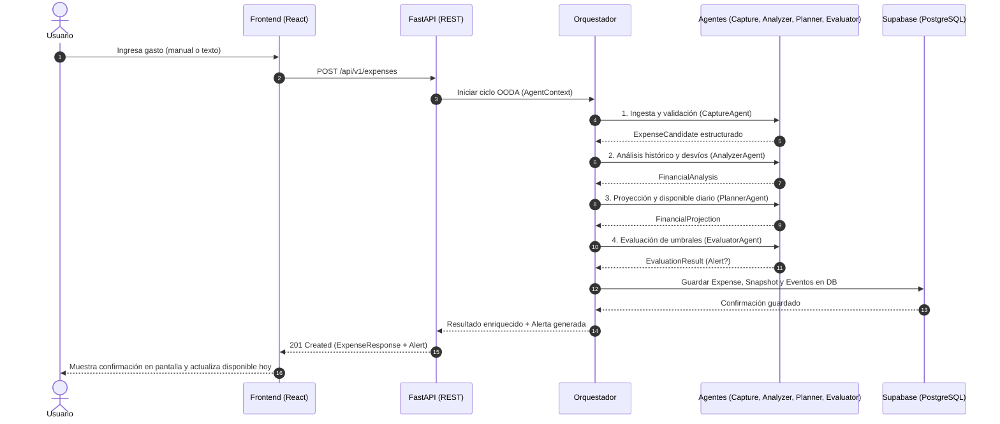

# Diagrama de Secuencia (UML) — Peso a Peso

## Secuencia: Registro de Gasto → Orquestación → Alerta

```mermaid
sequenceDiagram
    autonumber
    actor U as Usuario
    participant FE as Frontend (React)
    participant API as FastAPI (REST)
    participant ORQ as Orquestador
    participant AG as Agentes (Capture, Analyzer, Planner, Evaluator)
    participant DB as Supabase (PostgreSQL)

    U->>FE: Ingresa gasto (manual o texto)
    FE->>API: POST /api/v1/expenses
    API->>ORQ: Iniciar ciclo OODA (AgentContext)
    
    ORQ->>AG: 1. Ingesta y validación (CaptureAgent)
    AG-->>ORQ: ExpenseCandidate estructurado
    
    ORQ->>AG: 2. Análisis histórico y desvíos (AnalyzerAgent)
    AG-->>ORQ: FinancialAnalysis
    
    ORQ->>AG: 3. Proyección y disponible diario (PlannerAgent)
    AG-->>ORQ: FinancialProjection
    
    ORQ->>AG: 4. Evaluación de umbrales (EvaluatorAgent)
    AG-->>ORQ: EvaluationResult (Alert?)
    
    ORQ->>DB: Guardar Expense, Snapshot y Eventos en DB
    DB-->>ORQ: Confirmación guardado
    
    ORQ-->>API: Resultado enriquecido + Alerta generada
    API-->>FE: 201 Created (ExpenseResponse + Alert)
    FE-->>U: Muestra confirmación en pantalla y actualiza disponible hoy
```
