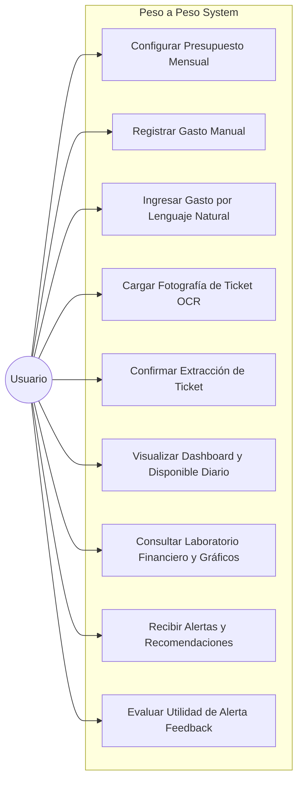

# Casos de Uso (UML) — Peso a Peso

```mermaid
graph LR
    User((Usuario))

    subgraph Peso a Peso System
        UC1[Configurar Presupuesto Mensual]
        UC2[Registrar Gasto Manual]
        UC3[Ingresar Gasto por Lenguaje Natural]
        UC4[Cargar Fotografía de Ticket OCR]
        UC5[Confirmar Extracción de Ticket]
        UC6[Visualizar Dashboard y Disponible Diario]
        UC7[Consultar Laboratorio Financiero y Gráficos]
        UC8[Recibir Alertas y Recomendaciones]
        UC9[Evaluar Utilidad de Alerta Feedback]
    end

    User --> UC1
    User --> UC2
    User --> UC3
    User --> UC4
    User --> UC5
    User --> UC6
    User --> UC7
    User --> UC8
    User --> UC9
```
